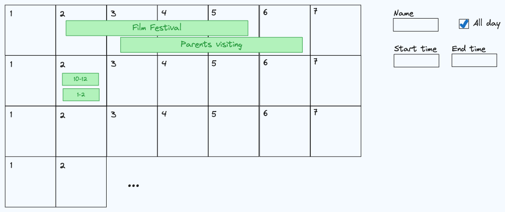

# Calendar Events

A calendar outline that allows you to add and delete events.

- The calendar itself doesn't need to function beyond showing 30 arbitrary days for which events can be added to.
- You can assume the user will not overlap events on the same day.

This component should meet the following requirements:

- [ ] The user can add an arbitrary number of events.
  - Events should consist of a start datetime, end datetime, and name
  - Events can be either all day spanning multiple days or a given time frame within a single day
  - Events that overlap across multiple days must stack in the order they were created
- [ ] User can delete an event by clicking on it and hitting delete.
