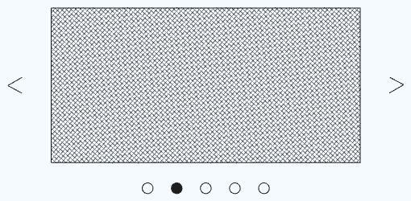

# Carousel

A classic image carousel

This component should meet the following requirements:

- [ ] Should load in an arbitrary number of images returned by `api.getImages`.
- [ ] User can click either the bubble below the image or the arrows to the left or right of the current image.
  - If user clicks past the last image, the Carousel wraps around and displays the first image.
- [ ] Images should 'slide' to the left or right when moving to the next or previous image.
