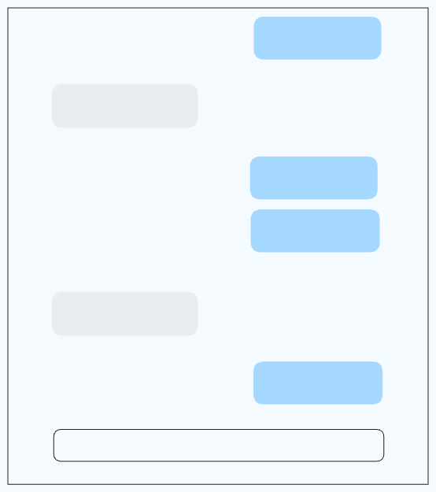

# Chat

Build an API chat app like Claud or ChatGPT

This component should meet the following requirements:

- [ ] Should be able to send a multi-line prompt to the mocked `Websocket`.

- [ ] The AI response from the mocked `Websocket` should be rendered as it is received

- [ ] Should format and display all messages in chronological order with newer messages appearing at the bottom of the screen.
