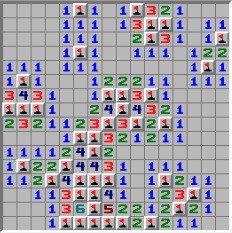

# Minesweeper

Build minesweeper!

===== Minesweeper light (easier) =====

Minesweeper has the following requirements:

- [ ] The user is presented with a 9x9 board of blank square tiles. There are 10 mines hidden beneath the tiles.

- [ ] If the user _left_ clicks on a tile, _only_ that tile is uncovered and can show 1 of two things:

  - A number representing the total number of adjacent squares that contain a bomb (or 0 for no adjacent bombs)
  - A bomb, in which case the game is over and the user looses.

- [ ] If the user _right_ clicks on a tile, then a 'flag' is placed on the tile. The flag has no effect and is purely for the convince of the user so they can track where possible bombs might be.

- [ ] If the only remaining covered tiles have bombs underneath them, the user wins the game.

===== Minesweeper Regular (harder) =====

Minesweeper has the following requirements:

- [ ] The user is presented with a 9x9 board of blank square tiles. There are 10 mines hidden beneath the tiles.

- [ ] If the user _left_ clicks on a tile, 1 of three things can happens:

  - A number greater than 0 is shown, representing the number of adjacent bombs (including diagonals).
  - A bomb is shown, in which case the user looses.
  - The tile is shown and all adjacent tiles are shown recursively up to and including any numbered tiles (but not bombs). See minesweeper game for an idea of how this mechanic works.

- [ ] If the user _right_ clicks on a tile, then a 'flag' is placed on the tile. If the user correctly flags all of the bombs (and _only_ flags the bombs) then they win.
