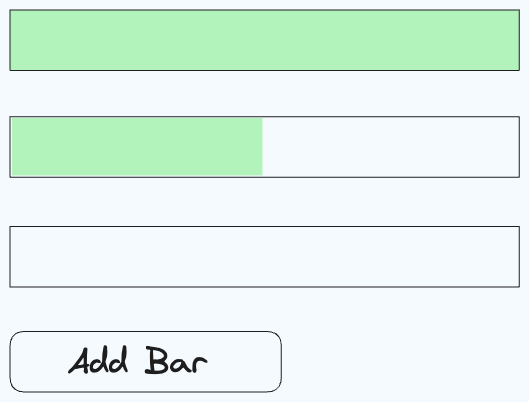

# Progress Bar

Build a progress bar

This component should meet the following requirements:

- [ ] When the "Add bar" button is clicked, a new progress bar should be added

- [ ] The progress bar takes 2s to fill up

- [ ] Progress bars must not begin filling up until the progress bar added before them is done
