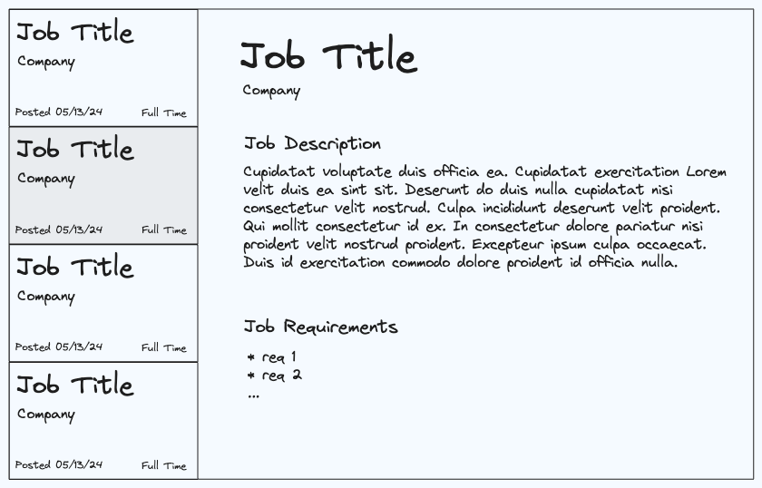

# Select And Examine

Build a select and examine component similar to the [Google Careers page](https://www.google.com/search?q=google+jobs)

This component should meet the following requirements:

- [ ] Load a list of available jobs from the `api.getJobs` endpoint and display the following properties for each job: job title, company name, formatted posted date, full time or part time.

- [ ] The jobs list should be scrollable.

- [ ] If the user clicks on a job, details about the job are fetched from `api.jobDescription(id)` and shown in the right hand panel. The following information should be shown: job title, company name, job description, job requirements.
