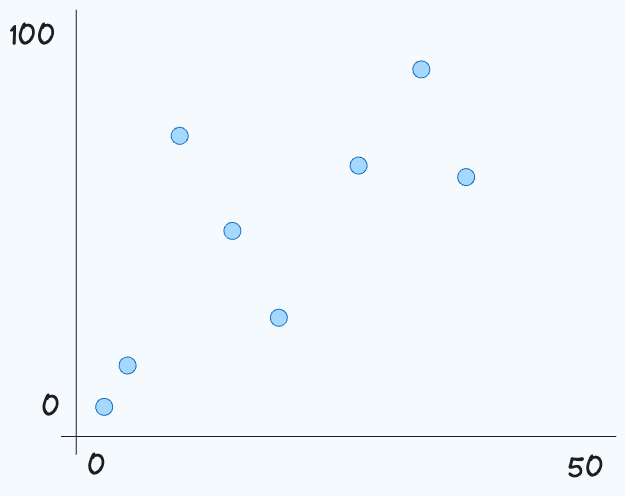

# Stock Ticker

Build a stock ticker price tracker.

This component should meet the following requirements:

- [ ] Should call `api.getPrice()` to get a new price for the stock.

- [ ] Display the last 50 seconds of the stock price.

- [ ] Display the price as a dot chart (see image).
