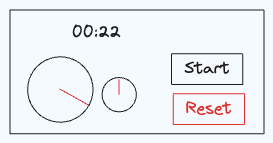

# Stop Watch

Build a stop watch component.

A stop watch component consists of the following requirements:

- [ ] The user should be able to start, stop, and reset the stop watch
- [ ] The miliseconds and seconds should be displayed to the user in two ways:
  - As a digital total elapsed time
  - As two analog clocks (one for seconds and one for miliseconds)
