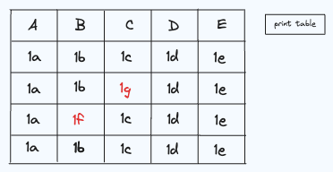

# Table Edit

Build a table where rows cells can be edited.

The table component has the following requirements:

- [ ] The table shape should be derived from 'table.json'

- [ ] Each cell of the table should be editable

- [ ] There should be a top level 'print' button which will print the contents of the table

- [ ] Table should be as performant as possible, re-rendering only when necessary and only re-rendering the minimum number of components
