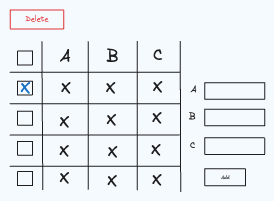

# Table Select

Build a table where rows can be bulk selected.

A bulk select table component consists of the following requirements:

- [ ] The table has three columns: A, B, and C

- [ ] Rows can be added to the table using the create row form input to the right of the table.

- [ ] The left most column of the table is a checkbox select. When a checkbox is selected, a delete button appears above the table. If
      the delete button is pressed, the selected rows are deleted.

- [ ] The checkbox in the column header selects or unselects all rows.
