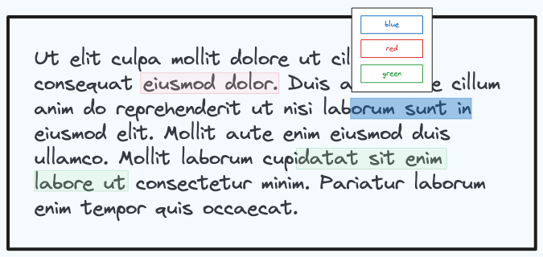

# Text Highlighter

Build a Text Highlighter component.

This component should meet the following requirements:

- [ ] Should take in a prop `text` which is a string of arbitrary length that represents the text to do the highlighting on.

- [ ] When the user selects the text, a popup appears with three options: Red, Blue, and Green. When a user selects an option, the text is highlighted in that color.

- [ ] User can select an arbitrary number of text segments to highlight.

- [ ] User can highlight text across any character (including spaces or in the middle of a word) and across multiple lines of text.
