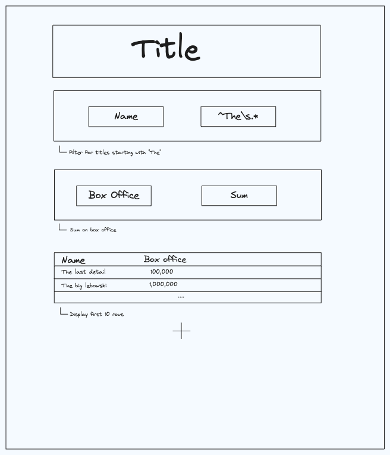

# Notebook

Build a jupyter-style Notebook UI.

- You can pretend that the data set is already loaded for you, which you can import directly as `data.json`. The data is from a movie theater showing how much money they brought in per-theater per-movie over some arbitrary time.
- You can assume that all columns are either text strings or integers.

This component should meet the following requirements:

- [ ] Blocks are uneditable when out of focus and become editable when focused

- [ ] The user can add 4 types of blocks:

1. Text blocks which can contain arbitrary header text
2. Filter blocks which can filter a text column by regex or a number column by a range
3. Aggregate blocks which can aggregate a text column by a unique count or a number by a sum
   -> note: aggregate columns remove all other columns and only return the aggregated one.
4. Display blocks which show the first ten rows of data in a column.

- [ ] The result from one block should be fed into the next block. Display blocks and Text blocks 'pass through' their inputs to the next block.
